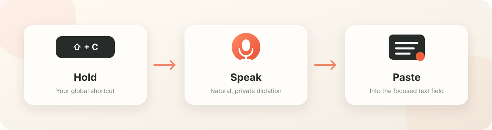

<p align="center">
  
</p>

<h1 align="center">SpeakIt</h1>

<p align="center"><strong>Free, private, on-device dictation for macOS.</strong></p>

<p align="center">
  
  
  
  <a href="LICENSE"></a>
</p>

<p align="center"><strong>Produced and created by Gabriel Pendleton.</strong></p>

SpeakIt is a free, local, Mac-first dictation app. Focus a text box, hold your shortcut, speak, and release. SpeakIt transcribes your voice on-device and pastes the result back into the app you were using.

No account, subscription, cloud transcription, or paid API is required.

<p align="center">
  
</p>

## Features

- Canary 180M Flash as the default local engine, supporting English, German, French, and Spanish
- Optional Whisper `small.en` engine for English dictation
- Fast on-device transcription optimized for Apple Silicon
- Customizable global push-to-talk shortcut
- Background operation after the main window is closed
- Automatic paste into the previously focused application
- Automatic cleanup of dictated clipboard text shortly after a successful paste
- Slide-out navigation with a dedicated local history view for the last five transcriptions
- Dedicated Speech models page with language, installation, and active-model information
- A fixed-size app window that cannot be accidentally expanded
- A click-through, voice-responsive rounded-bar waveform with quiet-room noise filtering
- Bottom-center overlay placement on the monitor containing the focused app
- Start and stop sound cues
- A built-in diagnostics report for microphone, Accessibility, model, installation, and recent events
- One separator space after each dictation so consecutive sentences do not run together

## Requirements

- macOS 13 or newer
- Apple Silicon Mac for the current packaged build
- Approximately 466 MB of disk space for Whisper; Canary Flash optionally adds about 214 MB
- Microphone permission for recording
- Accessibility permission for detecting the active app and pasting text

## Installation

1. Open the SpeakIt DMG.
2. Drag SpeakIt into the Applications folder.
3. Quit any older copy before opening the new Applications copy.
4. Allow Microphone and Accessibility access when macOS asks.
5. Download the local speech model from the setup screen.

Run SpeakIt from Applications rather than directly from the mounted installer. macOS permissions are associated with the installed and signed application copy.

## Using SpeakIt

1. Click the text field where you want the result.
2. Hold the configured shortcut.
3. Begin speaking after the start sound and listening waveform appear.
4. Release the shortcut when finished.
5. SpeakIt transcribes locally, restores the original app, and pastes the text.

The shortcut can be changed from the SpeakIt window and is saved between launches. The listening overlay appears on the monitor containing the focused application window and remains there for that recording.

Closing the SpeakIt window keeps dictation active in the background. Click the SpeakIt Dock icon to reopen the window, or use **Command-Q** when you want to quit SpeakIt completely.

Open the menu at the top left and choose **History** to see your newest five transcriptions. Use **Copy** to put an entry back on the clipboard or **Delete** to remove it from local history. Older entries are replaced automatically. Audio recordings are not saved.

Canary 180M Flash is the default speech engine. Open the top-left menu and choose **Speech models** to install or switch models and see their supported languages. Transcription timing and the selected engine are recorded in the local diagnostics log.

After automatic paste, SpeakIt clears its dictated text from the clipboard after a short delay. Different content copied in the meantime is left alone. If the paste helper fails, clipboard cleanup is skipped so you can paste manually. Copying an entry manually from history keeps it on the clipboard until you replace it.

## Privacy

Audio and transcripts remain on the Mac. SpeakIt does not send dictation to a transcription service. Network access is used only to download the open-source speech model you choose.

The model is stored under:

```text
~/Library/Application Support/SpeakIt/models/
```

## Permissions and troubleshooting

SpeakIt needs two macOS permissions:

- **Microphone:** records audio only while dictation is active.
- **Accessibility:** identifies the active application, restores it after transcription, and performs the paste command.

If automatic paste stops working, open **System Settings → Privacy & Security → Accessibility**, verify that the installed SpeakIt application is enabled, then restart SpeakIt.

Use **Run check** in SpeakIt's System diagnostics section to verify the microphone signal, Accessibility status, model installation, app location, and recent event timing. The report can be copied when filing an issue.

## Current scope

SpeakIt currently focuses on English voice-to-text dictation for macOS. Google Calendar integration and local note storage are not included in the current version.

## Creator

SpeakIt was conceived, produced, and created by **Gabriel Pendleton**.

## Speech model credits

- Whisper `small.en` is provided by the [whisper.cpp model project](https://huggingface.co/ggerganov/whisper.cpp).
- Canary 180M Flash was created by [NVIDIA](https://huggingface.co/nvidia/canary-180m-flash) and is offered under CC-BY-4.0. SpeakIt uses the [community ONNX conversion](https://huggingface.co/istupakov/canary-180m-flash-onnx) for local experimental inference.

## License

Copyright © 2026 Gabriel Pendleton.

SpeakIt is free software licensed under the **GNU General Public License v3.0**. You may use, study, modify, and distribute it under the terms of the GPL-3.0. Distributed modifications must remain open source under the same license and preserve the required notices.

See the full [LICENSE](LICENSE) or read the [GPL-3.0 overview](https://choosealicense.com/licenses/gpl-3.0/).
